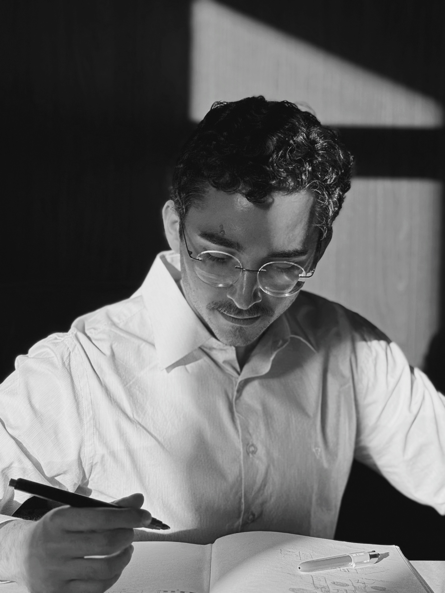

Sou Arthur Vilarinho, arquiteto e urbanista formado pelo Mackenzie, com foco em design paramétrico, BIM e soluções digitais.

Trabalho explorando a interseção entre arquitetura, programação e arte, desenvolvendo ferramentas com foco em desempenho, fabricação digital e sustentabilidade com a finalidade de otimizar processos de projeto.

Atualmente, uso o Blender como minha ferramenta principal, por ser a melhor em modelagem e edição de geometrias Mesh (Nick Dunn - Digital Fabrication in Architecture), por ter uma integração fluida com arquivos .ifc, o padrão para cooperatividade e coordenação das disciplinas de construção civil, e por ser baseada em Python, uma linguagem de programação bem difundida e acessível para criação de novos plugins. Também uso o Grasshopper do Rhinoceros, o melhor programa de modelagem paramétrica da atualidade e de grande relevância no meio profissional e acadêmico.

Acredito que a arquitetura é um campo em constante diálogo entre o concreto e o sensível. É uma importante forma de representar o espírito da nossa época (Zeitgheist) e criar conexões pessoais que importam.

Entre em contato e vamos fazer um projeto com a sua cara!

