## Descrição

O projeto em questão foi desenvolvido para o concurso CBCA de 2021, cujo tema era “Saúde e Bem-Estar”. A principal premissa do concurso era que o projeto só poderia ser concebido usando AÇO, então teríamos que levar o material ao seu limite criativo.

Eu (Arthur Vilarinho) me juntei com Ricardo Abreu, Mariana Manarelli e Louise Crivelenti, meus amigos de faculdade (que hoje são talentosos arquitetos formados) e encaramos este desafio com o professor orientador Ricardo Martos, a quem desenvolvemos uma grande amizade.

Abaixo segue a descrição desenvolvida para as pranchas finais do projeto.

## Local

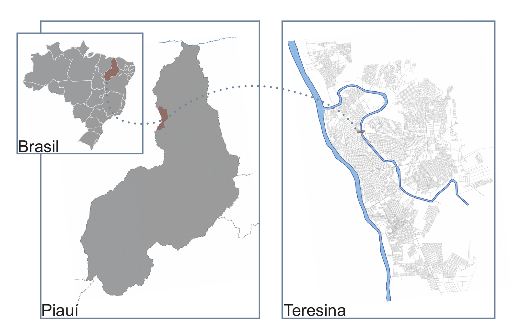

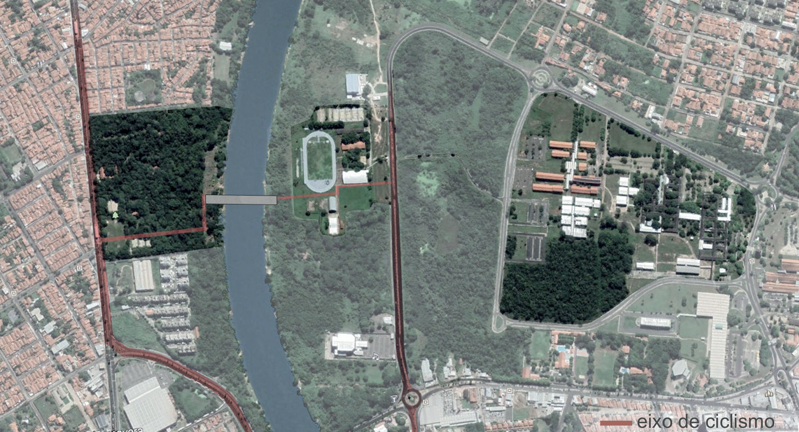

O local escolhido foi Teresina, capital do Piauí, com o edifício ponte sobre o Rio Poti, conectando o Parque da Cidade ao centro esportivo da UFPI. Isso une a região Centro-Norte (histórica) à Leste (em crescimento econômico), via Avenidas Raul Lopes e Marechal Castelo Branco, conhecidas por atividades físicas como ciclismo.

Teresina destaca-se negativamente nos índices de depressão e suicídio: entre 2010 e 2017, a taxa no Piauí foi de 10 mortes por 100 mil habitantes (quase o dobro da média brasileira de 5,6), com aumento de 47% no período. Isso reforça a necessidade de projetos de saúde mental.

## Projeto

Baseando-se nesse histórico do local, o objetivo do projeto foi criar um edifício ponte multifuncional como um eixo de saúde e bem-estar no centro da cidade de Teresina, com a conexão entre saúde física (centro esportivo da UFPI), saúde mental (CAPS) e bem-estar (Parque da Cidade e passeio público do edifício). Essas escolhas têm em vista a ODS número 3 como um todo, mas um enfoque especial na 3.4 que pretende ‘’reduzir em um terço a mortalidade prematura por doenças não transmissíveis (DNTs) via prevenção e tratamento, e promover a saúde mental e o bem-estar’’.

O projeto propõe um CAPS (Centro de Atenção Psicossocial) — que acolhe as pessoas com transtornos mentais e oferece-lhes atendimento médico e psicológico — associado a outros usos públicos, justamente para incentivar a integração entre os pacientes, a cidade e os demais habitantes de Teresina, com o intuito de combater a psicofobia e reinserir essas pessoas na sociedade.

A construção do programa de necessidades potencializa esse objetivo por contar com atividades coletivas nas oficinas, palestras e exposições, reunidas em um espaço integrado, onde as pessoas terão acesso à informação sobre os transtornos psicológicos e como lidar com eles.

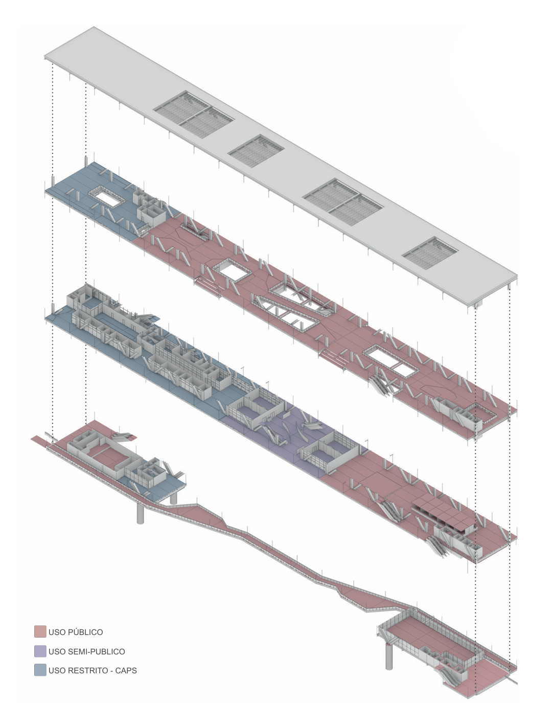

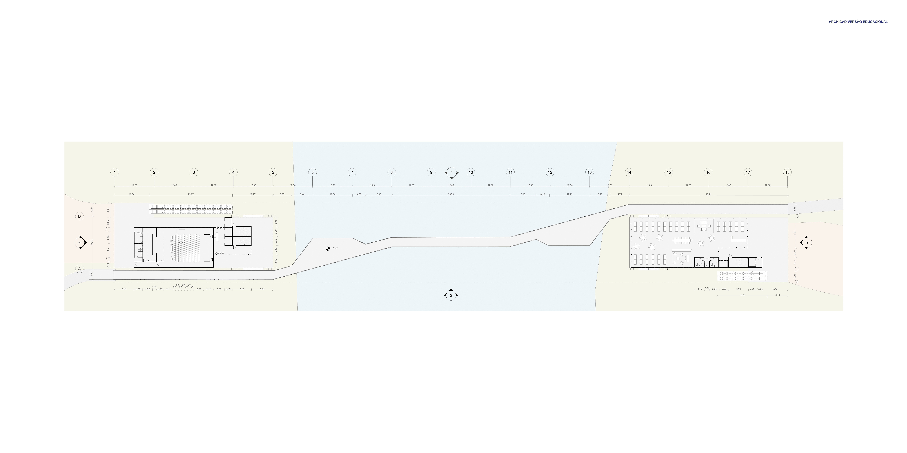

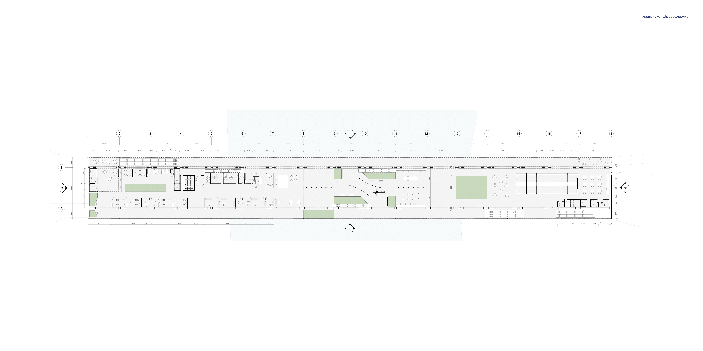

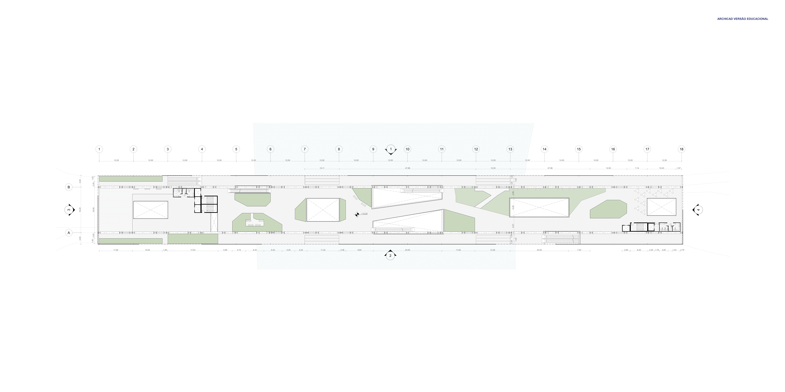

Tratando-se da chegada ao edifício pelo lado oeste, vindo do Parque da Cidade, o principal acesso vertical se dá por uma escada rolante que sobe dois pavimentos, chegando diretamente no passeio público. O uso restrito do CAPS se encontra no primeiro pavimento do lado oeste do edifício, e a opção por privar o mesmo de um grande fl uxo, incentiva o uso do passeio público.

Já na chegada pelo lado leste, vindo da UFPI e da Avenida Raul Lopes, o acesso vertical se dá em duas cotas, pois esse lado do edifício contém a praça de alimentação e as ofi cinas abertas.

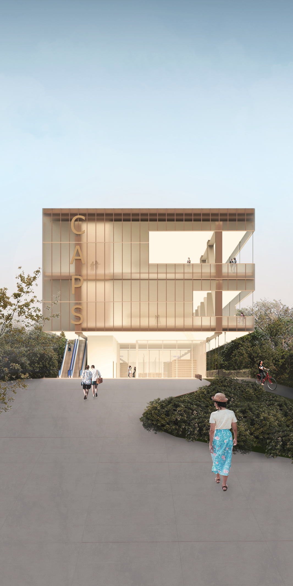

No pavimento do passeio, há diversos percursos e momentos de pausa e contemplação da vista; e, pensando no clima quente da região, as áreas de pausa serão cobertas para promover o conforto térmico e possibilitar a permanência.

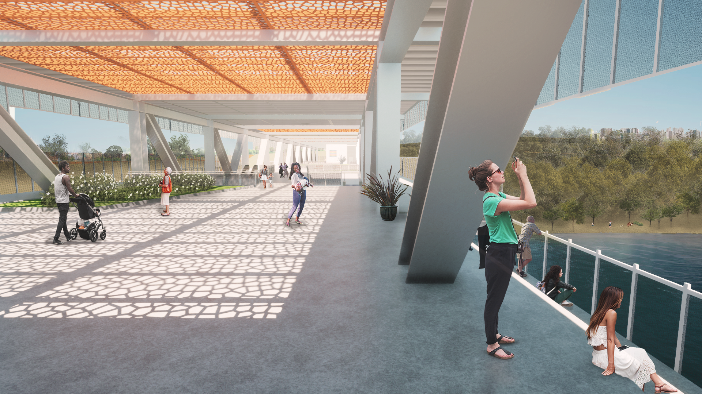

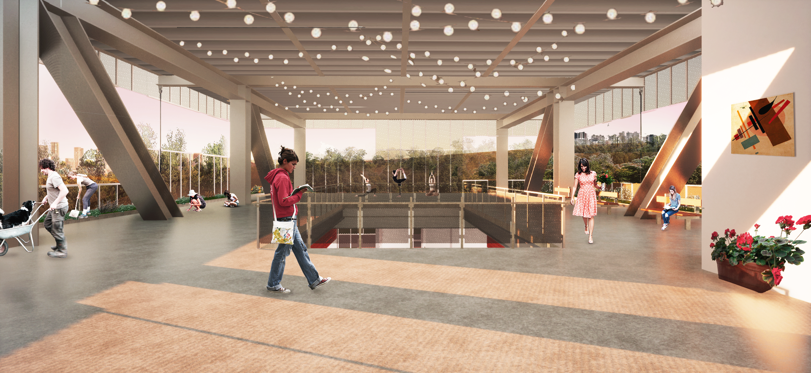

No centro desse pavimento, há a alternativa de descida para uma praça no primeiro pavimento, que conecta as ofi cinas do CAPS com usos mais públicos. Esta praça é um momento importante no projeto, pois pretende-se expor as produções das ofi cinas do CAPS e informações sobre saúde mental, criando essa interação entre os transeuntes e o trabalho do CAPS.

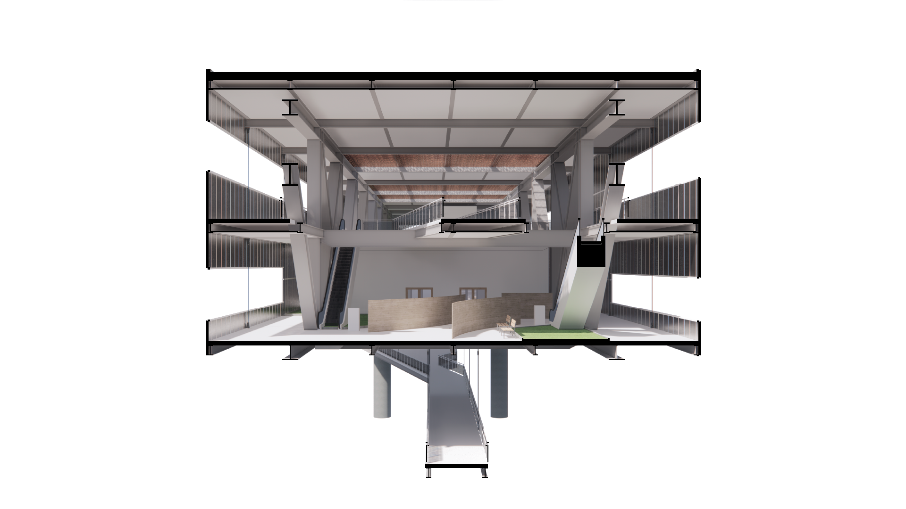

## Estrutura e Arquitetura

Para superar o vão de 120m sobre o rio, usamos duas treliças metálicas biapoiadas, com balanços nas extremidades e volumes atirantados para equilíbrio e menor deformação. Modulação de 12m x 12m otimiza esforços, com diagonais focadas em tração para esbeltez.

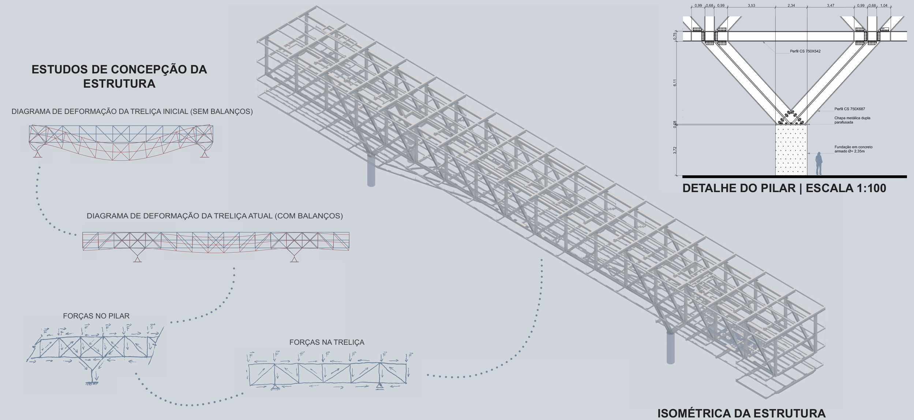

Estrutura transversal: Vigas centrais apoiam nas treliças; externas, apoiam em uma treliça e suspendem por tirantes. Pilares em V equilibrados pelos balanços, igualando esforços.

Fechamento: Chapas metálicas perfuradas para transparência, ventilação e destaque da treliça. Aberturas horizontais adaptadas aos usos, oferecendo vistas em áreas de passeio e privacidade em restritas.

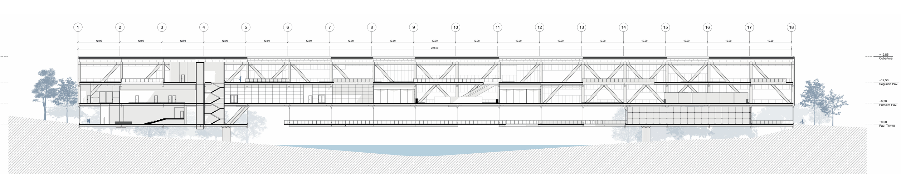

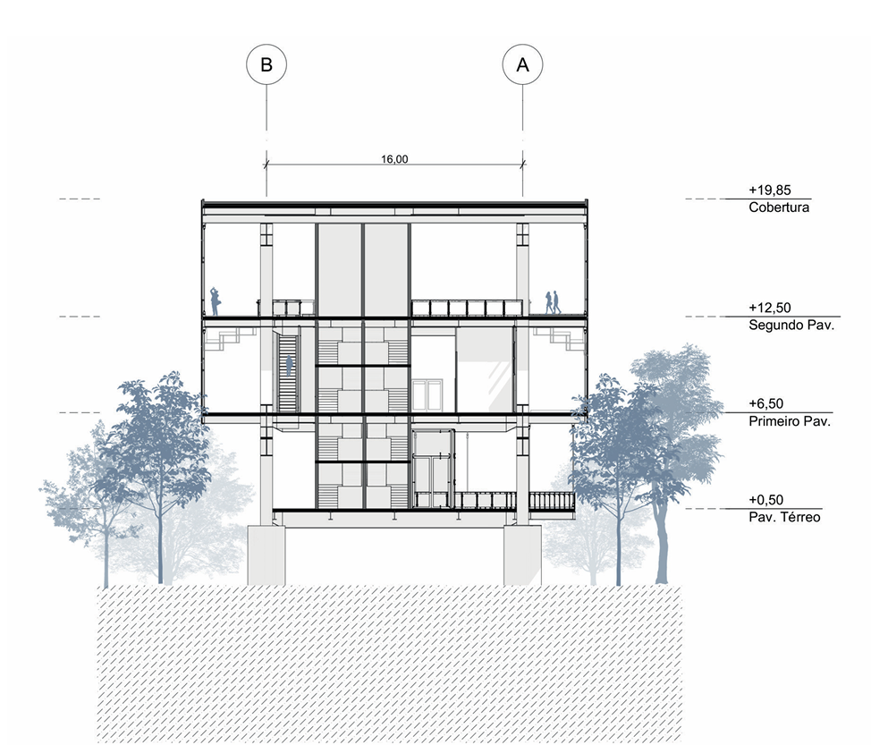

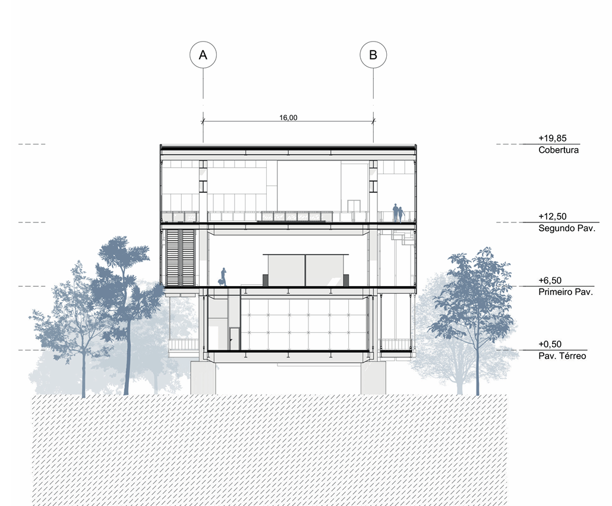

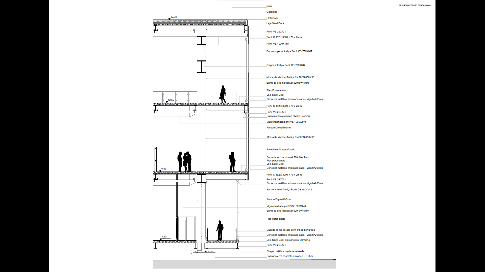

## Conclusão

O projeto para o concurso CBCA 2021 propõe um edifício ponte em Teresina que integra saúde física, mental e bem-estar, utilizando o aço de forma inovadora para conectar o Parque da Cidade à UFPI sobre o Rio Poti. Ao combinar um CAPS com espaços públicos, como oficinas e praças, busca combater a psicofobia e promover a reinserção social, alinhando-se à ODS 3.4. A estrutura de treliças metálicas e fechamentos perfurados garante funcionalidade, estética e conforto térmico, destacando o potencial do aço em soluções arquitetônicas. Este projeto não apenas responde ao desafio do concurso, mas também oferece um modelo de intervenção urbana que valoriza a saúde e a conexão comunitária em Teresina.