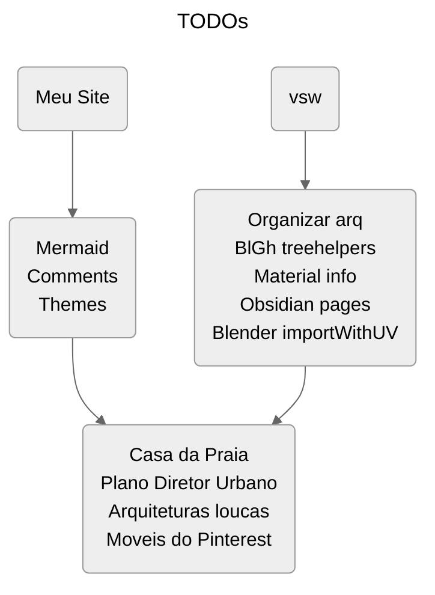
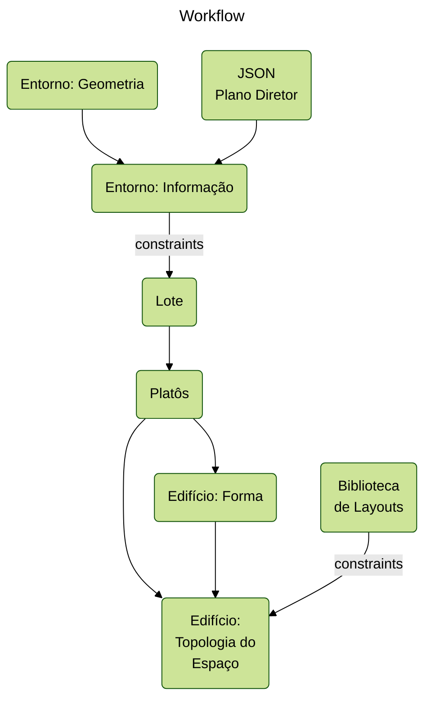

```mermaid
---
title: TODOs
displayMode: compact
config:
 theme: neutral
---
flowchart TB
	site(Meu Site)
	siteTODOS(
	Mermaid
	Comments
	Themes)
	site --> siteTODOS
	
	vsw(vsw)
	vswTODOS(Organizar arq
	BlGh treehelpers
	Material info
	Obsidian pages
	Blender importWithUV)
	vsw --> vswTODOS
	
	doing(Casa da Praia
	Plano Diretor Urbano
	Arquiteturas loucas
	Moveis do Pinterest)
	
	siteTODOS --> doing
	vswTODOS --> doing
```

```mermaid
---
title: Workflow 
displayMode: compact
config:
 theme: forest
---
flowchart TB
	urb1(Entorno: Geometria)
	urb2(Entorno: Informação)
	urbRef(JSON
	Plano Diretor)
	
	urb1 --> urb2
	urbRef --> urb2
	
	lote1(Lote)
	platos1(Platôs)
	ed1(Edifício: Forma)
	ed2(Edifício:
	Topologia do
	Espaço)
	lay1(Biblioteca
	de Layouts)
	
	urb2 --> | constraints | lote1
	lote1 --> platos1
	platos1 --> ed1
	platos1 --> ed2
	ed1 --> ed2
	lay1 --> | constraints | ed2
	
```